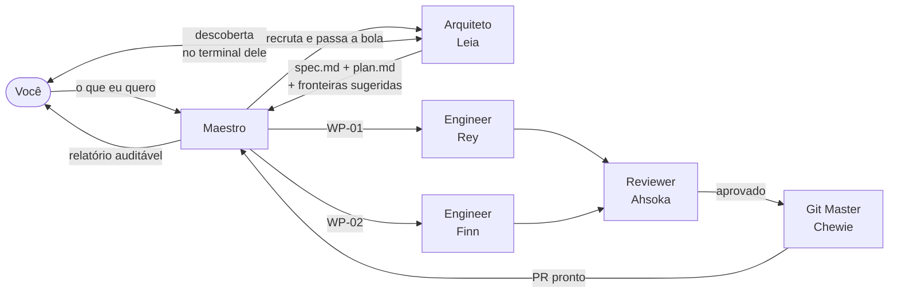

# SDD Maestri

**Spec-Driven Development para times de agentes de IA.** Uma skill que transforma o canvas do [Maestri](https://www.themaestri.app/) em uma orquestra: um contrato escrito antes da primeira linha de código, papéis com fronteiras que não se cruzam, e um painel que responde "onde estamos?" em três segundos.

[](LICENSE)
[](https://docs.claude.com/en/docs/claude-code/skills)
[](#contribuindo)

> *"Faça, ou não faça. Tentativa não há."* — aceite é binário, e gate reprovado não é entrega parcial.

---

## O problema

Rodar cinco agentes em paralelo é fácil. O que quebra é sempre a mesma coisa:

- **Dois agentes editam o mesmo arquivo** e um sobrescreve o outro sem ninguém perceber.
- **Cada um inventa uma regra de negócio diferente** porque ninguém escreveu qual era.
- **"Conforme combinamos no chat"** — que o outro terminal nunca viu, porque contexto não atravessa agente.
- **Todo mundo commita**, o histórico vira sopa e ninguém sabe o que foi revisado.
- **O orquestrador vira o gargalo**: lê o código todo, escreve a spec, particiona, revisa, e acaba implementando "porque era mais rápido".

## A ideia

A spec é o contrato, e o contrato existe **antes** do primeiro executor começar. Quando código e spec divergem, a spec ganha — o código é o bug. Quando um executor precisa inventar comportamento de produto, o contrato está incompleto, e a falha é de quem escreveu o contrato, não dele.

Sobre isso, três separações que a skill impõe:

| Separação | Por quê |
|---|---|
| Quem **escreve o contrato** não é quem **rege a execução** | São competências e perfis de custo diferentes: descoberta quer o modelo mais capaz e lê muito código; regência é sobretudo roteamento |
| Quem **produz** não é quem **aprova** | Revisor com o mesmo viés do implementador aprova o mesmo erro |
| Quem **implementa** não toca em **git** | Um dono de histórico, um commit por WP aprovada, nada entra sem veredito |

## Como funciona



O **Arquiteto** conversa com você, investiga o repositório e escreve o contrato — incluindo as **fronteiras de arquivo sugeridas**, que é o que permite ao Maestro particionar sem nunca reabrir o código. O **Maestro** recruta, delega, integra e reporta. Ninguém dos dois escreve código.

### Os papéis

| Papel | Faz | Preset sugerido |
|---|---|---|
| **Maestro** | Partição em WPs, recrutamento, delegação, integração, painel, relatório | equilibrado |
| **Arquiteto** | Descoberta com você, `spec.md` e `plan.md`, emenda de contrato | o mais capaz |
| **Engineer** (1–N) | Implementa WPs nos paths que possui | conforme o raio da mudança |
| **Reviewer** | Valida a WP contra o aceite, por `git diff` e evidência | capaz, e **diferente** do Engineer |
| **Git Master** | Branch, commit, push, PR — dono único do git | o mais barato |

Presets são **descobertos** em runtime via `maestri preset list`. A skill nunca fixa provedor ou modelo: ela é model-agnostic por design, e funciona com Claude Code, Codex, Gemini CLI, OpenCode ou o que você tiver configurado no workspace.

### As cinco regras que não se negociam

1. **Um dono por path.** Dois executores ativos nunca editam o mesmo arquivo.
2. **Git é só do Git Master.** Todo role de executor proíbe isso por escrito.
3. **Nada destrutivo ou externo sem autorização explícita** — merge, deploy, release, PR, ou deletar qualquer coisa do canvas.
4. **Handoff é por arquivo.** Não está na spec, no `tasks.md` ou no git: não existe.
5. **Quem produz não aprova.** Reviewer independente, de preferência em preset diferente.

## Instalação

```bash
git clone https://github.com/AndreRenatoMenezes/Spec-Driven-Dev-Maestri.git
cd Spec-Driven-Dev-Maestri

# disponível em todos os projetos
cp -r sdd-maestri ~/.claude/skills/

# ou apenas neste projeto
cp -r sdd-maestri .claude/skills/
```

Para acompanhar as atualizações do repositório, use um symlink no lugar da cópia:

```bash
ln -s "$(pwd)/sdd-maestri" ~/.claude/skills/sdd-maestri
```

Confirme com `/skills` na sessão do Claude Code — `sdd-maestri` deve aparecer na lista.

### Requisitos

- **[Maestri](https://www.themaestri.app/)** com a CLI `maestri` disponível no terminal, em **Modo Maestro**
- **Claude Code** (ou outro agente compatível com skills) no terminal do Maestro
- Um workspace com pelo menos dois terminais que você possa recrutar

Sem Maestri, a skill se desativa sozinha e recomenda um fluxo spec-driven de terminal único.

## Uso

Não há comando a decorar. Peça em linguagem natural no terminal do Maestro:

```
Monte um time para implementar login com Google.
```

A skill dispara em qualquer menção a Maestri, Modo Maestro, partitura, andar, recrutar agente ou git-master — e sempre que você pedir para orquestrar vários agentes numa feature grande.

O que acontece, em ordem: o Maestro inventaria o canvas, recruta o Arquiteto e **te passa o nome do terminal dele** — a descoberta acontece lá, em até três perguntas. O contrato volta pronto, o Maestro particiona em WPs, recruta o time e publica o painel. Você recebe um relatório a cada ciclo e a autorização de merge continua sendo sua.

### O que fica no disco

```
.claude/specs/
├── INBOX.md · ROADMAP.md · schema.md
├── equipe.md      ← codinome, preset, role, paths que possui
├── bloqueios.md   ← executores anexam ambiguidade e impedimento
├── decisoes.md    ← toda decisão reversível tomada sem consultar você
├── current/001-login/{spec,plan,tasks,tasks-done}.md
└── archive/<dominio>/ + INDEX.md
```

Disco é a fonte da verdade; a nota do canvas é espelho e caixa de entrada. O contrato vai versionado no git junto com o código que ele governa.

## Quando **não** usar

Tarefa que um agente conectado já resolve sozinho · bug de 10 linhas · protótipo descartável · terminal fora do Maestri.

Coordenar cinco agentes custa mais do que fazer — a skill só se paga quando a feature tem fronteiras de verdade para dividir.

## Estrutura do repositório

```
sdd-maestri/
├── SKILL.md              # ponto de entrada: princípio, papéis, ciclo, regras
├── agents/               # moldes de role, copiados para cada recruta
│   ├── maestro.md        # protocolo completo, autoridade, autochecagem
│   ├── arquiteto.md      # descoberta, contrato, emenda
│   ├── engineer.md
│   ├── reviewer.md
│   └── git-master.md
└── references/           # carregados sob demanda
    ├── descoberta.md     # as 3 perguntas, fronteira de autoridade
    ├── recrutamento.md   # presets, codinomes, ondas, delegação
    ├── painel.md         # a nota de painel no canvas
    └── partitura.md      # salvar o time como blueprint reaproveitável
```

**Economia de contexto é requisito, não otimização.** Cada token gasto aqui é multiplicado por N agentes: os moldes de `agents/` são copiados para dentro do role de cada recruta, e os `references/` carregam só quando o passo correspondente acontece. Nenhum executor lê a skill inteira — cada um recebe cinco referências nomeadas e nada além.

## Contribuindo

Issues e PRs são bem-vindos. Antes de abrir um PR:

- Mudança em `agents/` é multiplicada por agente recrutado — prefira cortar a acrescentar.
- Não duplique conteúdo entre `SKILL.md` e `agents/maestro.md`: são lidos em sequência pelo mesmo agente.
- Mantenha a skill **model-agnostic**. Nada de provedor, modelo ou flag de bypass de permissão hardcoded.
- Regra nova precisa vir com o caso real que a motivou.

## Licença

[MIT](LICENSE) © 2026 Andre Renato Menezes
