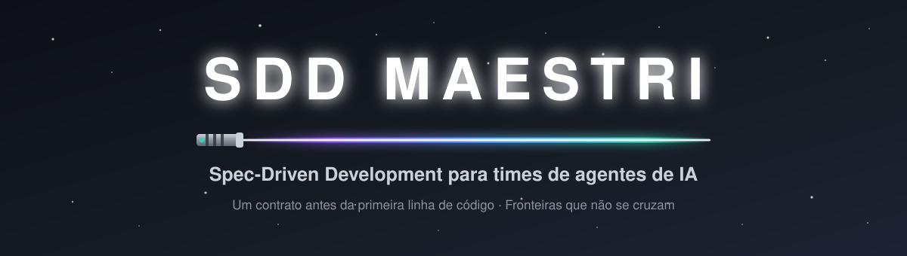
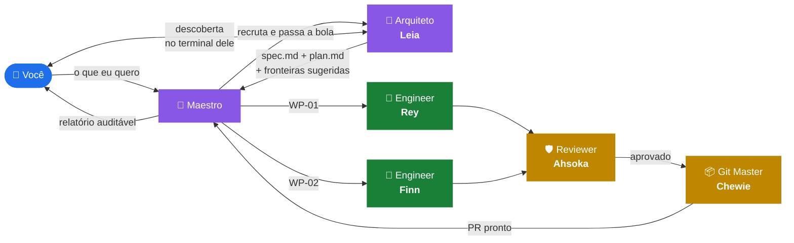

<div align="center">



<br/>


[](LICENSE)
[](https://docs.claude.com/en/docs/claude-code/skills)
[](https://www.themaestri.app/)
[](#-a-ordem)
[](#-junte-se-à-resistência)

</div>

> ### *"Faça, ou não faça. Tentativa não há."*
>
> Aceite é binário. Gate reprovado não é entrega parcial — é reprovado.

---

**Índice** · [O lado sombrio](#-o-lado-sombrio-da-paralelização) · [Os planos](#-os-planos-da-estrela-da-morte) · [A Ordem](#-a-ordem) · [O Código](#-o-código) · [Instalação](#-recrutamento) · [Primeira missão](#-primeira-missão) · [Quando não usar](#-nem-toda-missão-precisa-de-um-esquadrão) · [Contribuir](#-junte-se-à-resistência)

---

## ⚔️ O lado sombrio da paralelização

Rodar cinco agentes ao mesmo tempo é fácil. O que quebra é sempre a mesma coisa:

| | O que acontece |
|---|---|
| 💥 | **Dois agentes editam o mesmo arquivo** e um sobrescreve o outro sem ninguém perceber |
| 🌀 | **Cada um inventa uma regra de negócio diferente**, porque ninguém escreveu qual era |
| 👻 | **"Conforme combinamos no chat"** — que o outro terminal nunca viu. Contexto não atravessa agente |
| 🗑️ | **Todo mundo commita.** O histórico vira sopa e ninguém sabe o que foi revisado |
| 🕳️ | **O orquestrador vira o gargalo:** lê o código todo, escreve a spec, particiona, revisa — e acaba implementando "porque era mais rápido" |

> *"Nunca me diga as probabilidades."* — mas nesse caso as probabilidades são bem ruins.

## 📜 Os planos da Estrela da Morte

Em *Rogue One*, ninguém ataca a estação antes de roubar a planta. O esquadrão inteiro morre por um arquivo — porque atacar sem a especificação é como o time inteiro reescrever a mesma função em direções opostas.

Aqui é a mesma disciplina: **a spec é o contrato, e o contrato existe antes do primeiro executor começar.**

- Código e spec divergem? **A spec ganha.** O código é o bug.
- Executor precisou inventar comportamento de produto? **O contrato está incompleto** — a falha é de quem escreveu o contrato, não dele.
- Agente falhou? Diagnostique, refine o contrato, reatribua. **Você nunca vira o implementador reserva.**

Sobre isso, três separações que a skill impõe:

| Separação | Por quê |
|:--|:--|
| Quem **escreve o contrato** não é quem **rege a execução** | São competências e perfis de custo diferentes: descoberta quer o modelo mais capaz e lê muito código; regência é sobretudo roteamento |
| Quem **produz** não é quem **aprova** | Revisor com o mesmo viés do implementador aprova o mesmo erro |
| Quem **implementa** não toca em **git** | Um dono de histórico, um commit por WP aprovada, nada entra sem veredito |

## 🎼 A Ordem



O **Arquiteto** conversa com você, investiga o repositório e escreve o contrato — incluindo as **fronteiras de arquivo sugeridas**, que é o que permite ao Maestro particionar sem nunca reabrir o código. O **Maestro** recruta, delega, integra e reporta. Nenhum dos dois escreve uma linha.

| | Papel | Faz | Preset sugerido |
|:--:|:--|:--|:--|
|  | **Maestro** | Partição em WPs, recrutamento, delegação, integração, painel, relatório | equilibrado |
|  | **Arquiteto** | Descoberta com você, `spec.md` e `plan.md`, emenda de contrato | o mais capaz |
|  | **Engineer** (1–N) | Implementa WPs nos paths que possui | conforme o raio da mudança |
|  | **Reviewer** | Valida a WP contra o aceite, por `git diff` e evidência | capaz, e **diferente** do Engineer |
|  | **Git Master** | Branch, commit, push, PR — dono único do git | o mais barato |

> 🪐 **Model-agnostic por design.** Presets são descobertos em runtime via `maestri preset list` — a skill nunca fixa provedor ou modelo. Funciona com Claude Code, Codex, Gemini CLI, OpenCode ou o que você tiver configurado. *Muitos agentes, uma só Força.*

Os codinomes acima são exemplos. A regra é que sejam curtos, de uma palavra, sem hífen nem acento — `connect`, `ask` e `check` casam por nome exato — e que venham todos de um mesmo universo, para você lembrar quem é quem no canvas. O tema é seu; o nosso você já percebeu.

## 🛡️ O Código

> ### *"Este é o caminho."*

1. **Um dono por path.** Dois executores ativos nunca editam o mesmo arquivo.
2. **Git é só do Git Master.** Todo role de executor proíbe isso por escrito.
3. **Nada destrutivo ou externo sem autorização explícita** — merge, deploy, release, PR, ou deletar qualquer coisa do canvas.
4. **Handoff é por arquivo.** Não está na spec, no `tasks.md` ou no git: não existe.
5. **Quem produz não aprova.** Reviewer independente, de preferência em preset diferente.

## 🚀 Recrutamento

Na sessão do Claude Code, dois comandos:

```
/plugin marketplace add AndreRenatoMenezes/SDD-Maestri
/plugin install sdd-maestri@sdd-maestri
```

Confirme com `/skills` — `sdd-maestri` deve aparecer na lista. Para atualizar depois: `/plugin marketplace update sdd-maestri`.

<details>
<summary><b>Instalação manual, sem plugin</b></summary>

<br/>

```bash
git clone https://github.com/AndreRenatoMenezes/SDD-Maestri.git
cd SDD-Maestri

# disponível em todos os projetos
cp -r skills/sdd-maestri ~/.claude/skills/

# ou apenas neste projeto
cp -r skills/sdd-maestri .claude/skills/
```

Para acompanhar as atualizações do repositório, use um symlink no lugar da cópia:

```bash
ln -s "$(pwd)/skills/sdd-maestri" ~/.claude/skills/sdd-maestri
```

</details>

<details>
<summary><b>Requisitos</b></summary>

<br/>

- **[Maestri](https://www.themaestri.app/)** com a CLI `maestri` disponível no terminal, em **Modo Maestro**
- **Claude Code** (ou outro agente compatível com skills) no terminal do Maestro
- Um workspace com pelo menos dois terminais que você possa recrutar

Sem Maestri, a skill se desativa sozinha e recomenda um fluxo spec-driven de terminal único.

</details>

## 🎬 Primeira missão

Não há comando a decorar. Peça em linguagem natural no terminal do Maestro:

```
Monte um time para implementar login com Google.
```

A skill dispara em qualquer menção a Maestri, Modo Maestro, partitura, andar, recrutar agente ou git-master — e sempre que você pedir para orquestrar vários agentes numa feature grande.

O que acontece, em ordem:

```
1. 🎼  Maestro inventaria o canvas
2. 📐  Recruta o Arquiteto e te passa o nome do terminal dele
3. 💬  A descoberta acontece lá — até três perguntas, uma por vez
4. 📜  O contrato volta pronto: spec, plan e fronteiras sugeridas
5. ✂️  Maestro particiona em WPs e recruta o esquadrão
6. 📊  Painel publicado no canvas, atualizado a cada mudança de lane
7. 📨  Relatório auditável a cada ciclo — a autorização de merge é sua
```

<details>
<summary><b>O que fica no disco</b></summary>

<br/>

```
.claude/specs/
├── INBOX.md · ROADMAP.md · schema.md
├── equipe.md      ← codinome, preset, role, paths que possui
├── bloqueios.md   ← executores anexam ambiguidade e impedimento
├── decisoes.md    ← toda decisão reversível tomada sem consultar você
├── current/001-login/{spec,plan,tasks,tasks-done}.md
└── archive/<dominio>/ + INDEX.md
```

Disco é a fonte da verdade; a nota do canvas é espelho e caixa de entrada. O contrato vai versionado no git junto com o código que ele governa.

</details>

## 🌵 Nem toda missão precisa de um esquadrão

Tarefa que um agente conectado já resolve sozinho · bug de 10 linhas · protótipo descartável · terminal fora do Maestri.

Coordenar cinco agentes custa mais do que fazer. A skill só se paga quando a feature tem fronteiras de verdade para dividir — mandar a frota inteira atrás de um typo é como usar a Estrela da Morte para abrir uma noz.

## 🗂️ Estrutura do repositório

```
.claude-plugin/           # manifestos: o repo é plugin e marketplace ao mesmo tempo
├── plugin.json
└── marketplace.json
skills/sdd-maestri/
├── SKILL.md              # ponto de entrada: princípio, papéis, ciclo, regras
├── agents/               # moldes de role, copiados para cada recruta
│   ├── maestro.md        # protocolo completo, autoridade, autochecagem
│   ├── arquiteto.md      # descoberta, contrato, emenda
│   ├── engineer.md
│   ├── reviewer.md
│   └── git-master.md
└── references/           # carregados sob demanda
    ├── descoberta.md     # as 3 perguntas, fronteira de autoridade
    ├── recrutamento.md   # presets, codinomes, ondas, delegação
    ├── painel.md         # a nota de painel no canvas
    └── partitura.md      # salvar o time como blueprint reaproveitável
```

> ⚠️ Os `agents/` acima são **moldes de role em markdown**, lidos pelo Maestro — não são subagentes do Claude Code. Por isso ficam dentro da skill, e não na raiz do plugin.

> ⚡ **Economia de contexto é requisito, não otimização.** Cada token gasto aqui é multiplicado por N agentes: os moldes de `agents/` são copiados para dentro do role de cada recruta, e os `references/` carregam só quando o passo correspondente acontece. Nenhum executor lê a skill inteira — cada um recebe cinco referências nomeadas e nada além.

## 🤝 Junte-se à Resistência

Issues e PRs são bem-vindos. Antes de abrir um PR:

- Mudança em `agents/` é multiplicada por agente recrutado — **prefira cortar a acrescentar**.
- Não duplique conteúdo entre `SKILL.md` e `agents/maestro.md`: são lidos em sequência pelo mesmo agente.
- Mantenha a skill **model-agnostic**. Nada de provedor, modelo ou flag de bypass de permissão hardcoded.
- Regra nova precisa vir com o caso real que a motivou.

## 📄 Licença

[MIT](LICENSE) © 2026 Andre Renato Menezes

<div align="center">
<br/>

**Que a spec esteja com você.** ⭐

</div>
